# Блок-схемы модулей AMP Content Factory

Диаграммы написаны на Mermaid. Любой блок можно вставить в
[Mermaid Live Editor](https://mermaid.live/) и экспортировать в PNG или SVG.

## 1. Система целиком

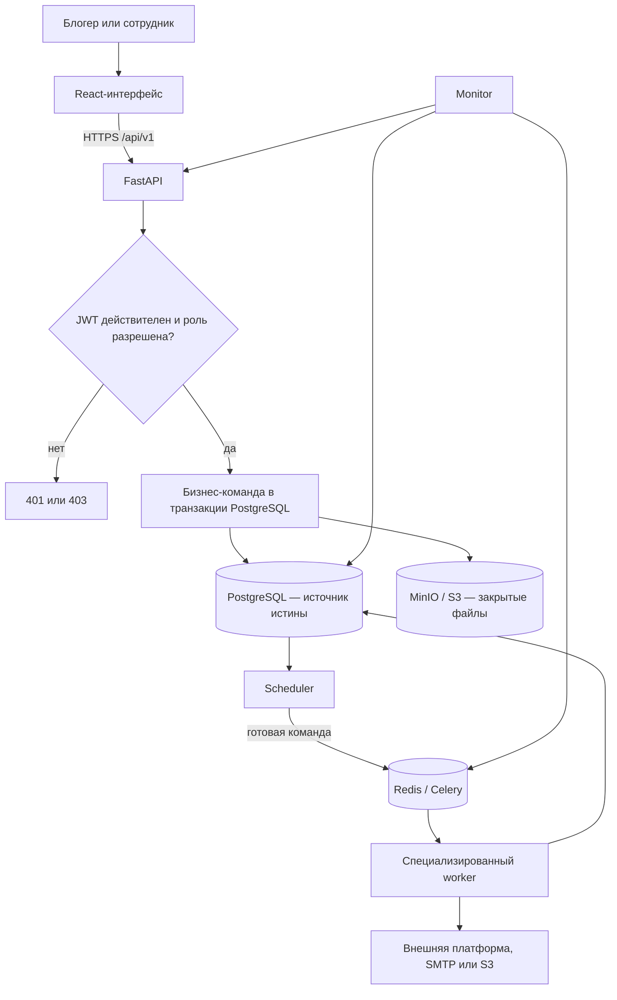
```mermaid
flowchart TD
    U[Блогер или сотрудник] --> WEB[React-интерфейс]
    WEB -->|HTTPS /api/v1| API[FastAPI]
    API --> AUTH{JWT действителен и роль разрешена?}
    AUTH -->|нет| E401[401 или 403]
    AUTH -->|да| TX[Бизнес-команда в транзакции PostgreSQL]
    TX --> DB[(PostgreSQL — источник истины)]
    TX --> OBJ[(MinIO / S3 — закрытые файлы)]
    DB --> SCH[Scheduler]
    SCH -->|готовая команда| REDIS[(Redis / Celery)]
    REDIS --> WORKER[Специализированный worker]
    WORKER --> EXT[Внешняя платформа, SMTP или S3]
    WORKER --> DB
    MON[Monitor] --> API
    MON --> DB
    MON --> REDIS
```

## 2. Общая обработка HTTP-запроса

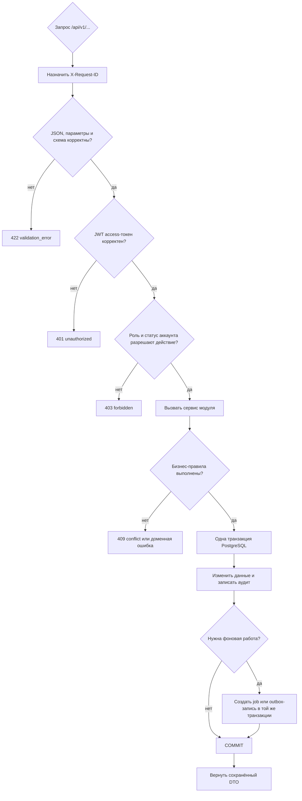
```mermaid
flowchart TD
    REQ{Запрос /api/v1/...} --> RID[Назначить X-Request-ID]
    RID --> VALID{JSON, параметры и схема корректны?}
    VALID -->|нет| E422[422 validation_error]
    VALID -->|да| TOKEN{JWT access-токен корректен?}
    TOKEN -->|нет| E401[401 unauthorized]
    TOKEN -->|да| ROLE{Роль и статус аккаунта разрешают действие?}
    ROLE -->|нет| E403[403 forbidden]
    ROLE -->|да| CMD[Вызвать сервис модуля]
    CMD --> RULES{Бизнес-правила выполнены?}
    RULES -->|нет| E409[409 conflict или доменная ошибка]
    RULES -->|да| TX[Одна транзакция PostgreSQL]
    TX --> WRITE[Изменить данные и записать аудит]
    WRITE --> BG{Нужна фоновая работа?}
    BG -->|да| JOB[Создать job или outbox-запись в той же транзакции]
    BG -->|нет| COMMIT[COMMIT]
    JOB --> COMMIT
    COMMIT --> RESP[Вернуть сохранённый DTO]
```

## 3. Авторизация и регистрация

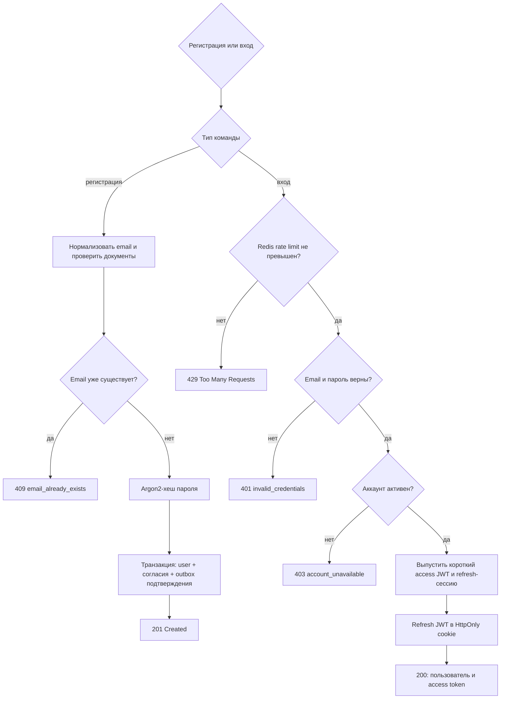
```mermaid
flowchart TD
    START{Регистрация или вход} --> KIND{Тип команды}
    KIND -->|регистрация| REG[Нормализовать email и проверить документы]
    REG --> EMAIL{Email уже существует?}
    EMAIL -->|да| E409[409 email_already_exists]
    EMAIL -->|нет| HASH[Argon2-хеш пароля]
    HASH --> RTX[Транзакция: user + согласия + outbox подтверждения]
    RTX --> R201[201 Created]
    KIND -->|вход| LIMIT{Redis rate limit не превышен?}
    LIMIT -->|нет| E429[429 Too Many Requests]
    LIMIT -->|да| CRED{Email и пароль верны?}
    CRED -->|нет| E401[401 invalid_credentials]
    CRED -->|да| STATUS{Аккаунт активен?}
    STATUS -->|нет| E403[403 account_unavailable]
    STATUS -->|да| TOKENS[Выпустить короткий access JWT и refresh-сессию]
    TOKENS --> COOKIE[Refresh JWT в HttpOnly cookie]
    COOKIE --> OK[200: пользователь и access token]
```

## 4. Обновление JWT-сессии

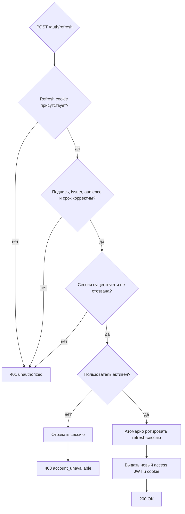
```mermaid
flowchart TD
    REQ{POST /auth/refresh} --> COOKIE{Refresh cookie присутствует?}
    COOKIE -->|нет| E401[401 unauthorized]
    COOKIE -->|да| JWT{Подпись, issuer, audience и срок корректны?}
    JWT -->|нет| E401
    JWT -->|да| SESSION{Сессия существует и не отозвана?}
    SESSION -->|нет| E401
    SESSION -->|да| USER{Пользователь активен?}
    USER -->|нет| REVOKE[Отозвать сессию]
    REVOKE --> E403[403 account_unavailable]
    USER -->|да| ROTATE[Атомарно ротировать refresh-сессию]
    ROTATE --> ACCESS[Выдать новый access JWT и cookie]
    ACCESS --> OK[200 OK]
```

## 5. Профиль блогера и социальные аккаунты

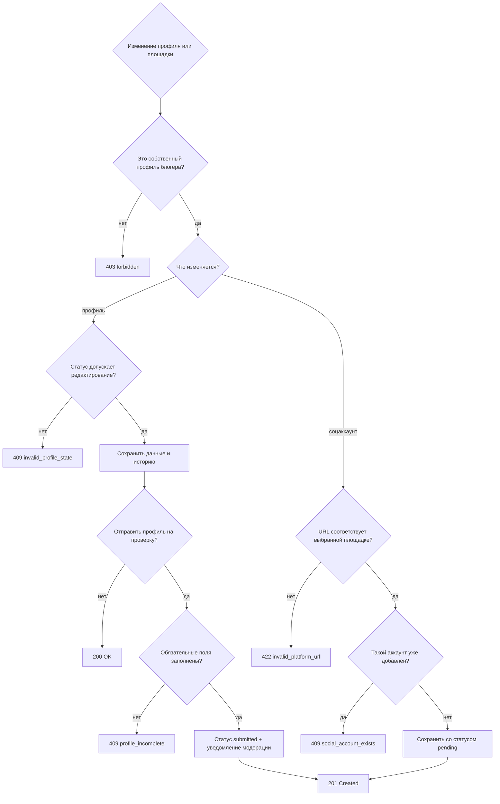
```mermaid
flowchart TD
    REQ{Изменение профиля или площадки} --> OWNER{Это собственный профиль блогера?}
    OWNER -->|нет| E403[403 forbidden]
    OWNER -->|да| TYPE{Что изменяется?}
    TYPE -->|профиль| EDITABLE{Статус допускает редактирование?}
    EDITABLE -->|нет| E409[409 invalid_profile_state]
    EDITABLE -->|да| SAVE[Сохранить данные и историю]
    TYPE -->|соцаккаунт| URL{URL соответствует выбранной площадке?}
    URL -->|нет| E422[422 invalid_platform_url]
    URL -->|да| UNIQUE{Такой аккаунт уже добавлен?}
    UNIQUE -->|да| E409A[409 social_account_exists]
    UNIQUE -->|нет| PENDING[Сохранить со статусом pending]
    SAVE --> SUBMIT{Отправить профиль на проверку?}
    SUBMIT -->|нет| OK[200 OK]
    SUBMIT -->|да| COMPLETE{Обязательные поля заполнены?}
    COMPLETE -->|нет| E409B[409 profile_incomplete]
    COMPLETE -->|да| REVIEW[Статус submitted + уведомление модерации]
    PENDING --> OK201[201 Created]
    REVIEW --> OK201
```

## 6. Модерация профиля и соцаккаунта

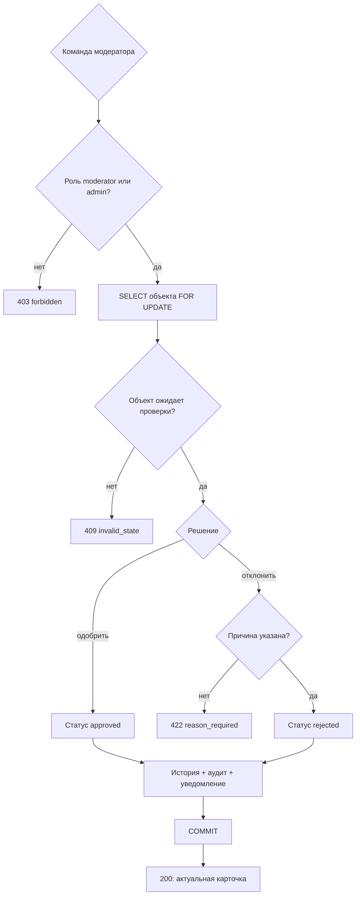
```mermaid
flowchart TD
    REQ{Команда модератора} --> AUTH{Роль moderator или admin?}
    AUTH -->|нет| E403[403 forbidden]
    AUTH -->|да| LOCK[SELECT объекта FOR UPDATE]
    LOCK --> STATE{Объект ожидает проверки?}
    STATE -->|нет| E409[409 invalid_state]
    STATE -->|да| DECISION{Решение}
    DECISION -->|одобрить| APPROVED[Статус approved]
    DECISION -->|отклонить| REASON{Причина указана?}
    REASON -->|нет| E422[422 reason_required]
    REASON -->|да| REJECTED[Статус rejected]
    APPROVED --> TX[История + аудит + уведомление]
    REJECTED --> TX
    TX --> COMMIT[COMMIT]
    COMMIT --> OK[200: актуальная карточка]
```

## 7. Каталог товаров

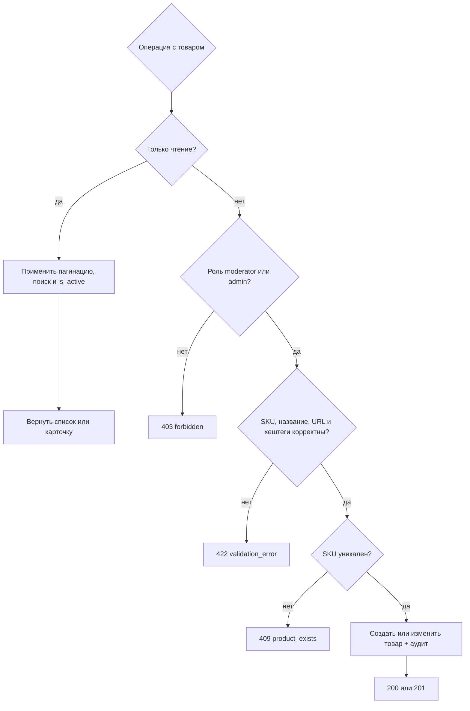
```mermaid
flowchart TD
    REQ{Операция с товаром} --> READ{Только чтение?}
    READ -->|да| FILTER[Применить пагинацию, поиск и is_active]
    FILTER --> LIST[Вернуть список или карточку]
    READ -->|нет| ROLE{Роль moderator или admin?}
    ROLE -->|нет| E403[403 forbidden]
    ROLE -->|да| DATA{SKU, название, URL и хештеги корректны?}
    DATA -->|нет| E422[422 validation_error]
    DATA -->|да| SKU{SKU уникален?}
    SKU -->|нет| E409[409 product_exists]
    SKU -->|да| TX[Создать или изменить товар + аудит]
    TX --> OK[200 или 201]
```

## 8. Карточка ролика и добавление публикации

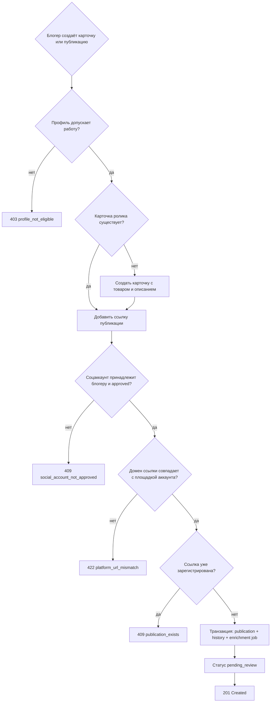
```mermaid
flowchart TD
    REQ{Блогер создаёт карточку или публикацию} --> PROFILE{Профиль допускает работу?}
    PROFILE -->|нет| E403[403 profile_not_eligible]
    PROFILE -->|да| CARD{Карточка ролика существует?}
    CARD -->|нет| CREATE[Создать карточку с товаром и описанием]
    CARD -->|да| PUB[Добавить ссылку публикации]
    CREATE --> PUB
    PUB --> ACCOUNT{Соцаккаунт принадлежит блогеру и approved?}
    ACCOUNT -->|нет| E409[409 social_account_not_approved]
    ACCOUNT -->|да| MATCH{Домен ссылки совпадает с площадкой аккаунта?}
    MATCH -->|нет| E422[422 platform_url_mismatch]
    MATCH -->|да| DUP{Ссылка уже зарегистрирована?}
    DUP -->|да| E409B[409 publication_exists]
    DUP -->|нет| TX[Транзакция: publication + history + enrichment job]
    TX --> PENDING[Статус pending_review]
    PENDING --> OK[201 Created]
```

## 9. Модерация публикации

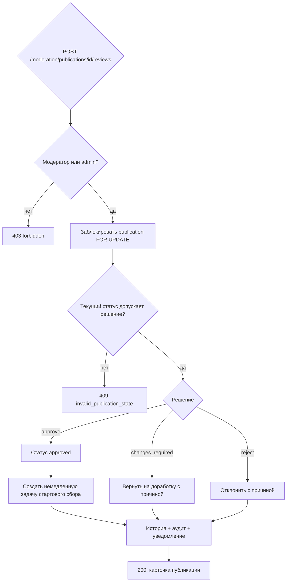
```mermaid
flowchart TD
    REQ{POST /moderation/publications/id/reviews} --> ROLE{Модератор или admin?}
    ROLE -->|нет| E403[403 forbidden]
    ROLE -->|да| LOCK[Заблокировать publication FOR UPDATE]
    LOCK --> STATE{Текущий статус допускает решение?}
    STATE -->|нет| E409[409 invalid_publication_state]
    STATE -->|да| ACTION{Решение}
    ACTION -->|approve| APPROVED[Статус approved]
    ACTION -->|changes_required| CHANGES[Вернуть на доработку с причиной]
    ACTION -->|reject| REJECTED[Отклонить с причиной]
    APPROVED --> BASELINE[Создать немедленную задачу стартового сбора]
    BASELINE --> TX[История + аудит + уведомление]
    CHANGES --> TX
    REJECTED --> TX
    TX --> OK[200: карточка публикации]
```

## 10. Планировщик фоновых задач

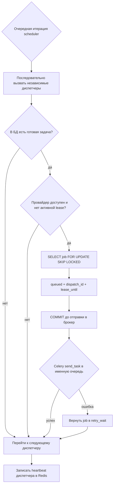
```mermaid
flowchart TD
    TICK{Очередная итерация scheduler} --> DISPATCH[Последовательно вызвать независимые диспетчеры]
    DISPATCH --> DUE{В БД есть готовая задача?}
    DUE -->|нет| NEXT[Перейти к следующему диспетчеру]
    DUE -->|да| PROVIDER{Провайдер доступен и нет активной lease?}
    PROVIDER -->|нет| NEXT
    PROVIDER -->|да| LOCK[SELECT job FOR UPDATE SKIP LOCKED]
    LOCK --> LEASE[queued + dispatch_id + lease_until]
    LEASE --> COMMIT[COMMIT до отправки в брокер]
    COMMIT --> SEND{Celery send_task в именную очередь}
    SEND -->|успех| NEXT
    SEND -->|ошибка| RELEASE[Вернуть job в retry_wait]
    RELEASE --> NEXT
    NEXT --> HEARTBEAT[Записать heartbeat диспетчера в Redis]
```

## 11. Общая механика платформенного worker

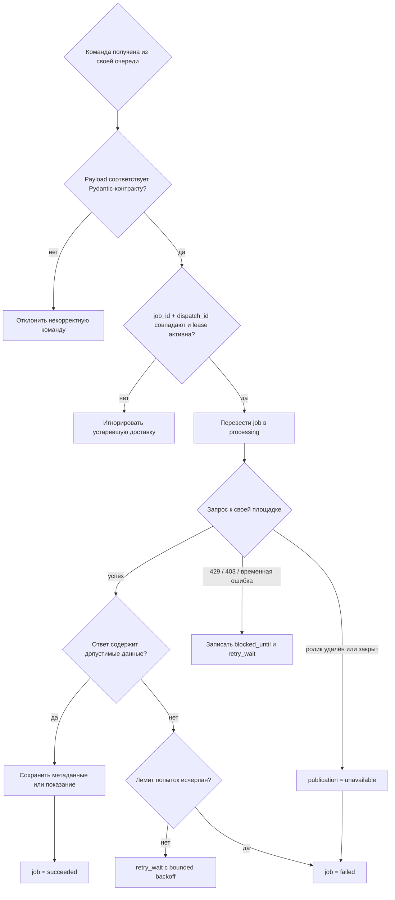
```mermaid
flowchart TD
    MSG{Команда получена из своей очереди} --> CONTRACT{Payload соответствует Pydantic-контракту?}
    CONTRACT -->|нет| DROP[Отклонить некорректную команду]
    CONTRACT -->|да| CLAIM{job_id + dispatch_id совпадают и lease активна?}
    CLAIM -->|нет| STALE[Игнорировать устаревшую доставку]
    CLAIM -->|да| PROCESSING[Перевести job в processing]
    PROCESSING --> CALL{Запрос к своей площадке}
    CALL -->|успех| VALID{Ответ содержит допустимые данные?}
    VALID -->|да| SAVE[Сохранить метаданные или показание]
    SAVE --> SUCCESS[job = succeeded]
    CALL -->|429 / 403 / временная ошибка| BLOCK[Записать blocked_until и retry_wait]
    VALID -->|нет| RETRY{Лимит попыток исчерпан?}
    RETRY -->|нет| WAIT[retry_wait с bounded backoff]
    RETRY -->|да| FAILED[job = failed]
    CALL -->|ролик удалён или закрыт| UNAVAILABLE[publication = unavailable]
    UNAVAILABLE --> FAILED
```

## 12. YouTube worker и квота

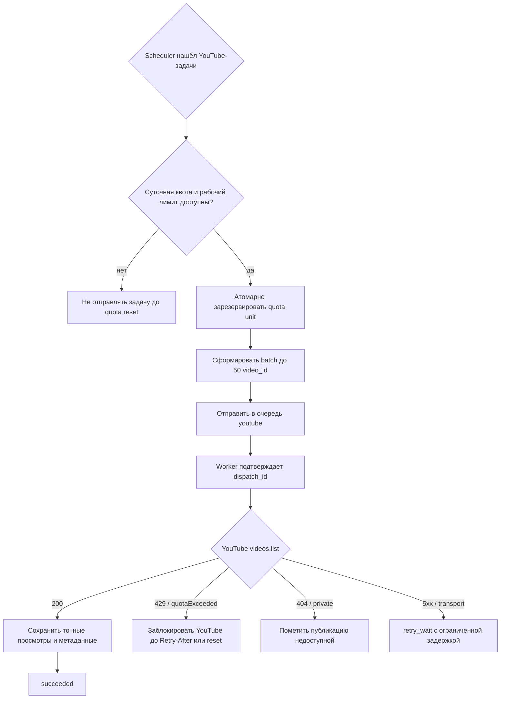
```mermaid
flowchart TD
    DUE{Scheduler нашёл YouTube-задачи} --> QUOTA{Суточная квота и рабочий лимит доступны?}
    QUOTA -->|нет| HOLD[Не отправлять задачу до quota reset]
    QUOTA -->|да| RESERVE[Атомарно зарезервировать quota unit]
    RESERVE --> BATCH[Сформировать batch до 50 video_id]
    BATCH --> QUEUE[Отправить в очередь youtube]
    QUEUE --> CLAIM[Worker подтверждает dispatch_id]
    CLAIM --> API{YouTube videos.list}
    API -->|200| STORE[Сохранить точные просмотры и метаданные]
    STORE --> SUCCESS[succeeded]
    API -->|429 / quotaExceeded| BLOCK[Заблокировать YouTube до Retry-After или reset]
    API -->|404 / private| GONE[Пометить публикацию недоступной]
    API -->|5xx / transport| BACKOFF[retry_wait с ограниченной задержкой]
```

## 13. TikTok worker

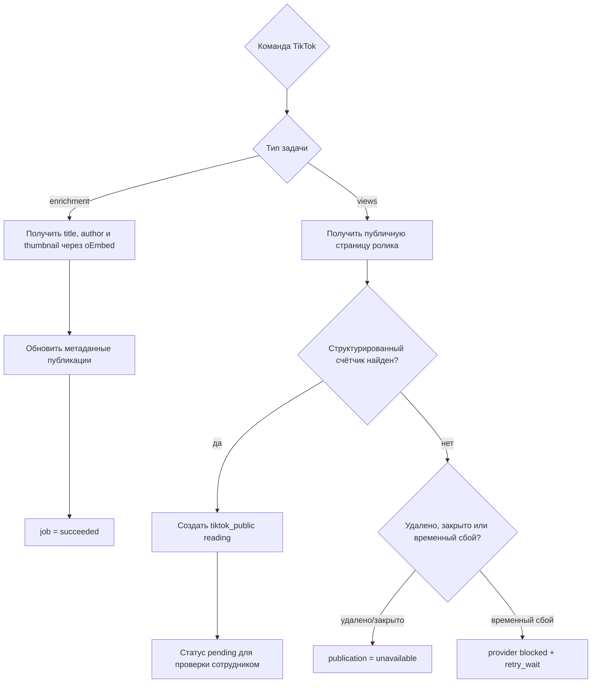
```mermaid
flowchart TD
    JOB{Команда TikTok} --> TYPE{Тип задачи}
    TYPE -->|enrichment| OEMBED[Получить title, author и thumbnail через oEmbed]
    TYPE -->|views| PAGE[Получить публичную страницу ролика]
    PAGE --> PARSE{Структурированный счётчик найден?}
    PARSE -->|да| READING[Создать tiktok_public reading]
    READING --> REVIEW[Статус pending для проверки сотрудником]
    OEMBED --> META[Обновить метаданные публикации]
    META --> SUCCESS[job = succeeded]
    PARSE -->|нет| ERROR{Удалено, закрыто или временный сбой?}
    ERROR -->|удалено/закрыто| GONE[publication = unavailable]
    ERROR -->|временный сбой| WAIT[provider blocked + retry_wait]
```

## 14. VK Video worker

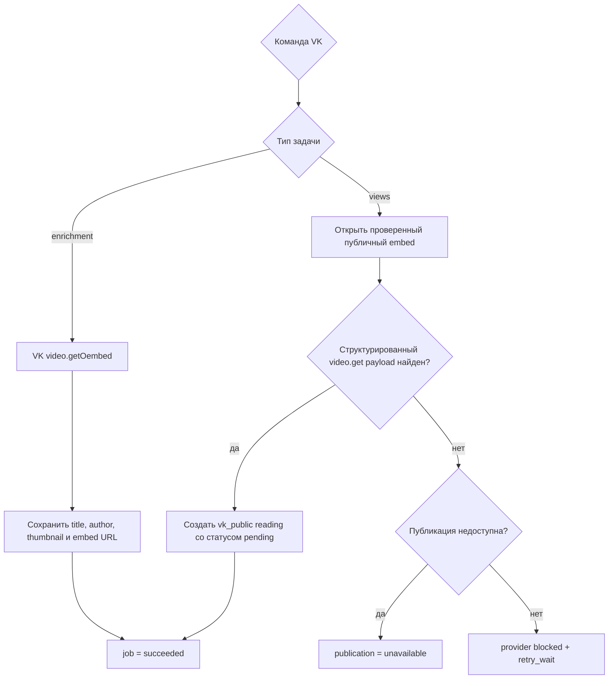
```mermaid
flowchart TD
    JOB{Команда VK} --> TYPE{Тип задачи}
    TYPE -->|enrichment| OEMBED[VK video.getOembed]
    OEMBED --> EMBED[Сохранить title, author, thumbnail и embed URL]
    TYPE -->|views| PLAYER[Открыть проверенный публичный embed]
    PLAYER --> DATA{Структурированный video.get payload найден?}
    DATA -->|да| READING[Создать vk_public reading со статусом pending]
    DATA -->|нет| ERROR{Публикация недоступна?}
    ERROR -->|да| GONE[publication = unavailable]
    ERROR -->|нет| WAIT[provider blocked + retry_wait]
    EMBED --> SUCCESS[job = succeeded]
    READING --> SUCCESS
```

## 15. Rutube worker

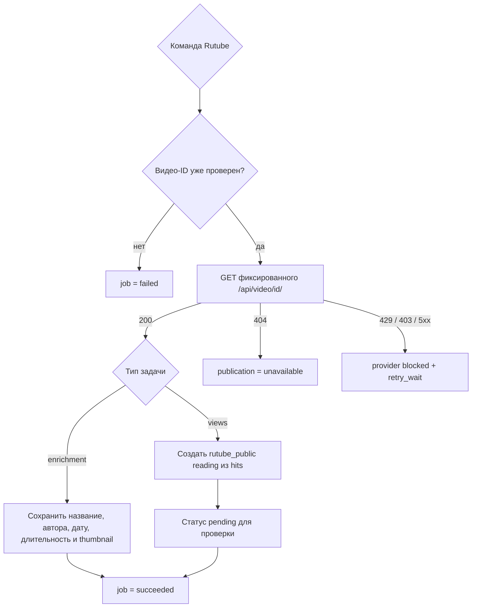
```mermaid
flowchart TD
    JOB{Команда Rutube} --> ID{Видео-ID уже проверен?}
    ID -->|нет| FAILED[job = failed]
    ID -->|да| API[GET фиксированного /api/video/id/]
    API -->|200| TYPE{Тип задачи}
    TYPE -->|enrichment| META[Сохранить название, автора, дату, длительность и thumbnail]
    TYPE -->|views| HITS[Создать rutube_public reading из hits]
    HITS --> REVIEW[Статус pending для проверки]
    META --> SUCCESS[job = succeeded]
    REVIEW --> SUCCESS
    API -->|404| GONE[publication = unavailable]
    API -->|429 / 403 / 5xx| WAIT[provider blocked + retry_wait]
```

## 16. Instagram worker

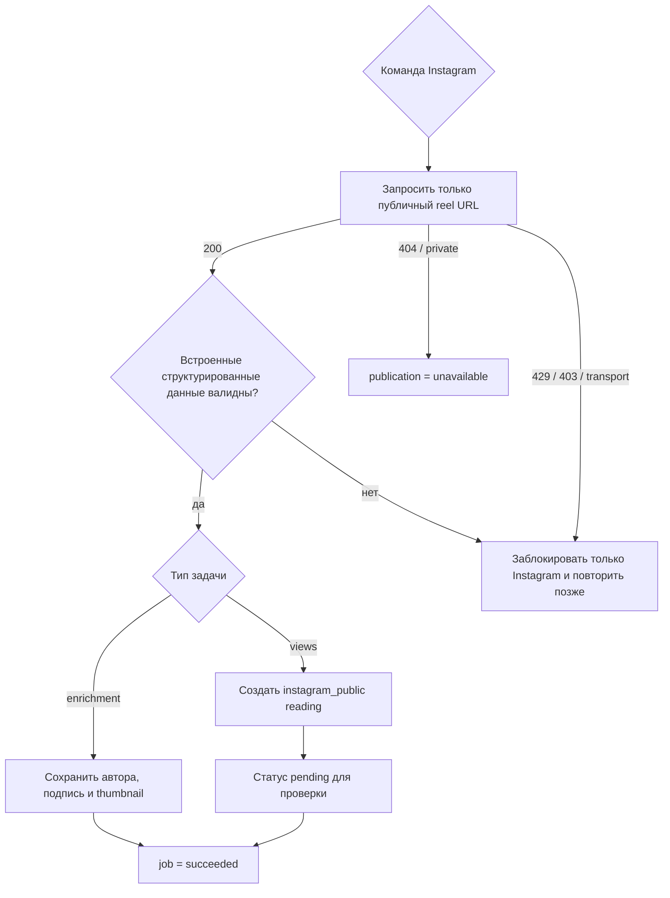
```mermaid
flowchart TD
    JOB{Команда Instagram} --> PAGE[Запросить только публичный reel URL]
    PAGE -->|200| STRUCT{Встроенные структурированные данные валидны?}
    STRUCT -->|да| TYPE{Тип задачи}
    TYPE -->|enrichment| META[Сохранить автора, подпись и thumbnail]
    TYPE -->|views| COUNT[Создать instagram_public reading]
    COUNT --> REVIEW[Статус pending для проверки]
    META --> SUCCESS[job = succeeded]
    REVIEW --> SUCCESS
    PAGE -->|404 / private| GONE[publication = unavailable]
    PAGE -->|429 / 403 / transport| WAIT[Заблокировать только Instagram и повторить позже]
    STRUCT -->|нет| WAIT
```

## 17. Дзен worker

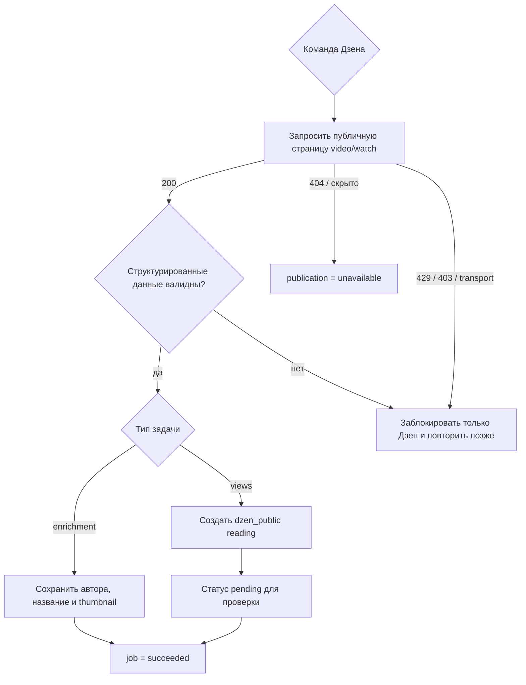
```mermaid
flowchart TD
    JOB{Команда Дзена} --> PAGE[Запросить публичную страницу video/watch]
    PAGE -->|200| STRUCT{Структурированные данные валидны?}
    STRUCT -->|да| TYPE{Тип задачи}
    TYPE -->|enrichment| META[Сохранить автора, название и thumbnail]
    TYPE -->|views| COUNT[Создать dzen_public reading]
    COUNT --> REVIEW[Статус pending для проверки]
    META --> SUCCESS[job = succeeded]
    REVIEW --> SUCCESS
    PAGE -->|404 / скрыто| GONE[publication = unavailable]
    PAGE -->|429 / 403 / transport| WAIT[Заблокировать только Дзен и повторить позже]
    STRUCT -->|нет| WAIT
```

## 18. Показания просмотров

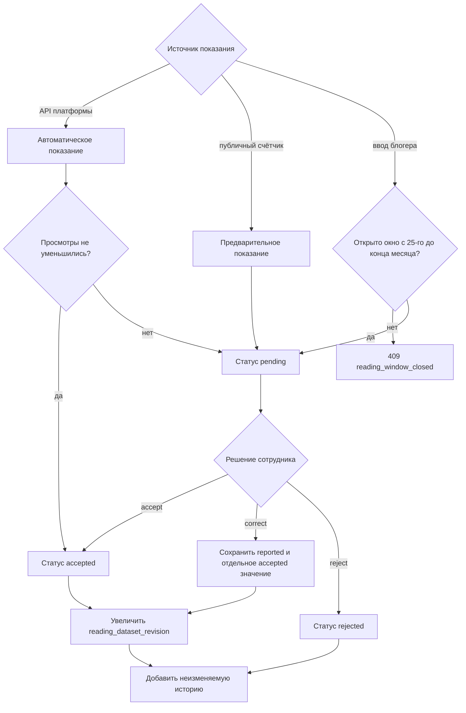
```mermaid
flowchart TD
    SOURCE{Источник показания} -->|API платформы| AUTO[Автоматическое показание]
    SOURCE -->|публичный счётчик| PUBLIC[Предварительное показание]
    SOURCE -->|ввод блогера| MANUAL{Открыто окно с 25-го до конца месяца?}
    MANUAL -->|нет| E409[409 reading_window_closed]
    MANUAL -->|да| PENDING[Статус pending]
    AUTO --> CHECK{Просмотры не уменьшились?}
    CHECK -->|да| ACCEPTED[Статус accepted]
    CHECK -->|нет| PENDING
    PUBLIC --> PENDING
    PENDING --> REVIEW{Решение сотрудника}
    REVIEW -->|accept| ACCEPTED
    REVIEW -->|correct| CORRECTED[Сохранить reported и отдельное accepted значение]
    REVIEW -->|reject| REJECTED[Статус rejected]
    ACCEPTED --> REV[Увеличить reading_dataset_revision]
    CORRECTED --> REV
    REJECTED --> HISTORY[Добавить неизменяемую историю]
    REV --> HISTORY
```

## 19. Расчётный период и начисления

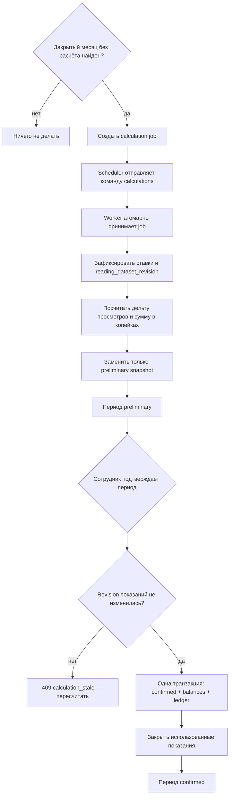
```mermaid
flowchart TD
    SCH{Закрытый месяц без расчёта найден?} -->|нет| STOP[Ничего не делать]
    SCH -->|да| JOB[Создать calculation job]
    JOB --> QUEUE[Scheduler отправляет команду calculations]
    QUEUE --> CLAIM[Worker атомарно принимает job]
    CLAIM --> SNAPSHOT[Зафиксировать ставки и reading_dataset_revision]
    SNAPSHOT --> CALC[Посчитать дельту просмотров и сумму в копейках]
    CALC --> REPLACE[Заменить только preliminary snapshot]
    REPLACE --> PRELIM[Период preliminary]
    PRELIM --> CONFIRM{Сотрудник подтверждает период}
    CONFIRM --> REV{Revision показаний не изменилась?}
    REV -->|нет| E409[409 calculation_stale — пересчитать]
    REV -->|да| TX[Одна транзакция: confirmed + balances + ledger]
    TX --> CLOSED[Закрыть использованные показания]
    CLOSED --> OK[Период confirmed]
```

## 20. Выплаты

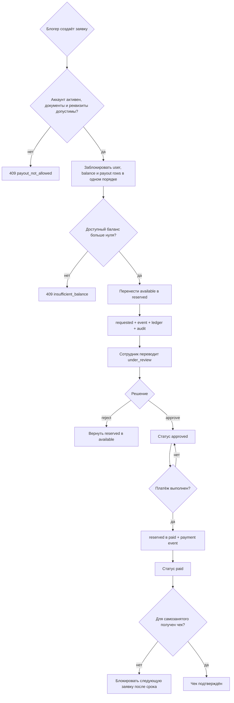
```mermaid
flowchart TD
    REQ{Блогер создаёт заявку} --> ELIGIBLE{Аккаунт активен, документы и реквизиты допустимы?}
    ELIGIBLE -->|нет| E409[409 payout_not_allowed]
    ELIGIBLE -->|да| LOCK[Заблокировать user, balance и payout rows в одном порядке]
    LOCK --> BALANCE{Доступный баланс больше нуля?}
    BALANCE -->|нет| E409B[409 insufficient_balance]
    BALANCE -->|да| RESERVE[Перенести available в reserved]
    RESERVE --> REQUESTED[requested + event + ledger + audit]
    REQUESTED --> REVIEW[Сотрудник переводит under_review]
    REVIEW --> DECISION{Решение}
    DECISION -->|reject| RELEASE[Вернуть reserved в available]
    DECISION -->|approve| APPROVED[Статус approved]
    APPROVED --> PAYMENT{Платёж выполнен?}
    PAYMENT -->|нет| APPROVED
    PAYMENT -->|да| SETTLE[reserved в paid + payment event]
    SETTLE --> PAID[Статус paid]
    PAID --> RECEIPT{Для самозанятого получен чек?}
    RECEIPT -->|нет| OVERDUE[Блокировать следующую заявку после срока]
    RECEIPT -->|да| COMPLETE[Чек подтверждён]
```

## 21. Выгрузки CSV/XLSX

```mermaid
flowchart TD
    REQ{POST /staff/exports} --> ROLE{Роль разрешает тип отчёта?}
    ROLE -->|нет| E403[403 forbidden]
    ROLE -->|да| FILTER{Диапазон дат и фильтры корректны?}
    FILTER -->|нет| E422[422 validation_error]
    FILTER -->|да| IDEM{Такая idempotency-команда уже была?}
    IDEM -->|да| EXISTING[Вернуть существующую job]
    IDEM -->|нет| JOB[Создать export_job = pending]
    JOB --> R202[202 Accepted]
    JOB --> SCHED[Scheduler: lease и очередь exports]
    SCHED --> WORKER[Export worker]
    WORKER --> SNAPSHOT{Строк не больше 10000?}
    SNAPSHOT -->|нет| FAILED[failed: export_too_large]
    SNAPSHOT -->|да| BUILD[Сформировать CSV/XLSX из колонок в коде]
    BUILD --> SAFE[Экранировать формулы и посчитать SHA-256]
    SAFE --> S3[Загрузить в закрытый MinIO/S3]
    S3 --> READY[job = ready на 24 часа]
    READY --> DOWNLOAD{Текущая роль всё ещё разрешает скачивание?}
    DOWNLOAD -->|нет| E403
    DOWNLOAD -->|да| FILE[Потоковая выдача файла + аудит]
```

## 22. Уведомления и email outbox

```mermaid
flowchart TD
    DOMAIN{Доменное событие} --> TEMPLATE[Выбрать активную версию шаблона]
    TEMPLATE --> RENDER{Все разрешённые переменные переданы?}
    RENDER -->|нет| ROLLBACK[Откатить бизнес-транзакцию]
    RENDER -->|да| TX[В той же транзакции создать notification]
    TX --> EMAIL{Нужно письмо?}
    EMAIL -->|нет| COMMIT[COMMIT]
    EMAIL -->|да| OUTBOX[Создать готовый outbox payload]
    OUTBOX --> COMMIT
    COMMIT --> SCHED[Scheduler назначает dispatch_id и lease]
    SCHED --> QUEUE[Очередь email]
    QUEUE --> CLAIM[Email worker подтверждает dispatch_id]
    CLAIM --> SMTP{SMTP принял письмо?}
    SMTP -->|да| SENT[outbox = dispatched]
    SMTP -->|нет| RETRY[outbox = pending с bounded backoff]
```

## 23. Обращения в поддержку

```mermaid
flowchart TD
    CREATE{Создание обращения} --> CATEGORY{Категория разрешена роли пользователя?}
    CATEGORY -->|нет| E403[403 forbidden]
    CATEGORY -->|да| IDEM{Idempotency key уже использован?}
    IDEM -->|другой payload| E409[409 idempotency_conflict]
    IDEM -->|тот же payload| EXISTING[Вернуть существующее обращение]
    IDEM -->|нет| TX[Транзакция: ticket + message + event]
    TX --> NOTIFY[Уведомить нужную группу сотрудников]
    NOTIFY --> NEW[Статус new]
    NEW --> INPROGRESS[in_progress]
    INPROGRESS --> WAITING[waiting_blogger]
    WAITING --> INPROGRESS
    INPROGRESS --> RESOLVED[resolved]
    WAITING --> RESOLVED
    RESOLVED --> CLOSED[closed]
    NEW -->|недопустимый переход| E409S[409 invalid_status_transition]
```

## 24. Юридические документы

```mermaid
flowchart TD
    ADMIN{Администратор публикует документ} --> VALID{Тип, версия и текст корректны?}
    VALID -->|нет| E422[422 validation_error]
    VALID -->|да| VERSION[Создать новую неизменяемую версию]
    VERSION --> ACTIVE[Сделать её текущей]
    ACTIVE --> USERS[Пользователям доступно чтение]
    USERS --> ACCEPT{Пользователь принимает текущую версию?}
    ACCEPT -->|нет| STATUS[Показать обязательное действие в кабинете]
    ACCEPT -->|да| UNIQUE{Принятие уже записано?}
    UNIQUE -->|да| EXISTING[Вернуть существующий факт]
    UNIQUE -->|нет| TX[Записать version_id, пользователя, дату и аудит]
    TX --> COMPLETE[Юридический статус обновлён]
```

## 25. Жизненный цикл аккаунта

```mermaid
flowchart TD
    ACTIVITY{Значимое действие блогера} --> UPDATE[Обновить last_activity и revision]
    SCAN{Почасовой scan scheduler} --> DUE{Достигнут порог неактивности?}
    DUE -->|нет| STOP[Ничего не делать]
    DUE -->|да| JOB[Создать lifecycle job с текущей revision]
    JOB --> QUEUE[Очередь lifecycle]
    QUEUE --> CLAIM[Worker принимает команду]
    CLAIM --> REV{Revision всё ещё совпадает?}
    REV -->|нет| OBSOLETE[job succeeded как устаревшая команда]
    REV -->|да| ACTION{Тип перехода}
    ACTION -->|warning| WARN[Уведомление о неактивности]
    ACTION -->|suspend| SUSPEND[Приостановить аккаунт и публикации]
    ACTION -->|expire balance| EXPIRE[Зафиксировать истечение права требования]
    WARN --> SUCCESS[job = succeeded]
    SUSPEND --> SUCCESS
    EXPIRE --> SUCCESS
```

## 26. Удаление аккаунта

```mermaid
flowchart TD
    REQ{Запрос удаления} --> PASSWORD{Текущий пароль верен?}
    PASSWORD -->|нет| E401[401 invalid_credentials]
    PASSWORD -->|да| TOKEN[Создать случайный токен, хранить только SHA-256]
    TOKEN --> OUTBOX[Отправить ссылку через email outbox]
    OUTBOX --> R202[202 Accepted]
    CONFIRM{Публичное подтверждение токеном} --> LIMIT{Rate limit не превышен?}
    LIMIT -->|нет| E429[429 Too Many Requests]
    LIMIT -->|да| DIGEST{Digest найден, не использован и не истёк?}
    DIGEST -->|нет| E400[400 invalid_or_expired_token]
    DIGEST -->|да| LOCK[Заблокировать user, balance и активные payouts]
    LOCK --> BLOCKERS{Есть деньги, активная выплата, долг по чеку или preliminary доход?}
    BLOCKERS -->|да| E409[409 deletion_blocked]
    BLOCKERS -->|нет| TX[Одна транзакция удаления]
    TX --> EFFECTS[Отозвать сессии, остановить публикации и jobs, пометить профиль deleted]
    EFFECTS --> AUDIT[История удаления и security event]
    AUDIT --> DONE[204 No Content]
```

## 27. Retention и обезличивание

```mermaid
flowchart TD
    RUN{Ежедневная maintenance-команда} --> LOCK{Получен lock процесса?}
    LOCK -->|нет| STOP[Завершить без параллельного запуска]
    LOCK -->|да| SELECT[Выбрать ограниченный batch удалённых аккаунтов]
    SELECT --> CUTOFF{Прошло не меньше 5 лет от последнего значимого события?}
    CUTOFF -->|нет| SKIP[Не изменять данные]
    CUTOFF -->|да| TERMINAL{Все выплаты в terminal-состоянии?}
    TERMINAL -->|нет| SKIP
    TERMINAL -->|да| ANON[Односторонне обезличить PII]
    ANON --> KEEP[Сохранить UUID, суммы, статусы, даты, ledger и статистику]
    KEEP --> AUDIT[Записать факт retention]
    AUDIT --> NEXT{Есть следующий batch?}
    NEXT -->|да| SELECT
    NEXT -->|нет| DONE[Завершить процесс]
```

## 28. Журнал безопасности

```mermaid
flowchart TD
    ACTION{Значимое действие} --> CONTEXT[Получить actor, role, request_id, IP и user-agent]
    CONTEXT --> FACTS[Сформировать понятные структурированные факты]
    FACTS --> TX[Добавить security_event в бизнес-транзакцию]
    TX --> BUSINESS{Бизнес-команда успешна?}
    BUSINESS -->|нет| ROLLBACK[Откатить и данные, и событие]
    BUSINESS -->|да| COMMIT[COMMIT]
    COMMIT --> READ{Администратор открывает журнал}
    READ --> FILTER[Фильтры по действию, пользователю и времени]
    FILTER --> DETAIL[Понятное название действия, причина и изменённый объект]
```

## 29. Dashboard и аналитика

```mermaid
flowchart TD
    REQ{GET dashboard или analytics} --> ROLE{Определить роль пользователя}
    ROLE -->|blogger| OWN[Только собственные публикации, просмотры, доход и задачи]
    ROLE -->|staff| SCOPE[Применить разрешённый роли операционный срез]
    SCOPE --> QUERY[Агрегирующие SELECT-запросы PostgreSQL]
    OWN --> QUERY
    QUERY --> DTO[Собрать стабильный response DTO]
    DTO --> EMPTY{Данные отсутствуют?}
    EMPTY -->|да| ZERO[Вернуть нули и пустые списки, не ошибку]
    EMPTY -->|нет| VALUES[Вернуть показатели и ссылки на рабочие разделы]
    ZERO --> UI[React отображает dashboard]
    VALUES --> UI
```

## 30. Мониторинг и готовность

```mermaid
flowchart TD
    CHECK{Цикл monitor} --> READY[Проверить /health/ready]
    READY --> DB[Проверить PostgreSQL и состояния jobs]
    DB --> REDIS[Проверить Redis и heartbeat scheduler]
    REDIS --> WORKERS[Проверить потребителей всех очередей Celery]
    WORKERS --> ISSUES{Есть stale heartbeat, overdue job, expired lease или массовые failures?}
    ISSUES -->|нет| HEALTHY[Обновить метрики: система здорова]
    ISSUES -->|да| CHANGED{Набор проблем изменился или пора напомнить?}
    CHANGED -->|нет| WAIT[Ждать следующий цикл]
    CHANGED -->|да| ALERT[Отправить оператору email с конкретными проблемами]
    ALERT --> WAIT
    HEALTHY --> RESOLVED{Ранее была авария?}
    RESOLVED -->|да| RECOVERY[Отправить уведомление о восстановлении]
    RESOLVED -->|нет| WAIT
```

## 31. Интерфейс React

```mermaid
flowchart TD
    OPEN{Пользователь открывает приложение} --> ME[GET /auth/me]
    ME -->|401| REFRESH{POST /auth/refresh успешен?}
    REFRESH -->|нет| LOGIN[Экран входа]
    REFRESH -->|да| WORKSPACE[Рабочее пространство]
    ME -->|200| WORKSPACE
    LOGIN --> AUTH{Вход успешен?}
    AUTH -->|нет| ERROR[Показать понятную ошибку]
    AUTH -->|да| WORKSPACE
    WORKSPACE --> NAV[Меню формируется по роли]
    NAV --> PAGE[Загрузить данные выбранного раздела]
    PAGE --> STATE{Результат запроса}
    STATE -->|loading| SKELETON[Стабильное состояние загрузки]
    STATE -->|empty| EMPTY[Понятное пустое состояние]
    STATE -->|error| ERROR
    STATE -->|data| CONTENT[Таблица, карточка или форма]
    CONTENT --> COMMAND{Пользователь выполняет команду}
    COMMAND -->|успех| REFRESH_DATA[Обновить данные без рывка интерфейса]
    COMMAND -->|ошибка| ERROR
```

## 32. Управление пользователями

```mermaid
flowchart TD
    REQ{Изменение роли или доступа} --> ADMIN{Текущий пользователь всё ещё активный admin?}
    ADMIN -->|нет| E403[403 admin_permission_changed]
    ADMIN -->|да| LOCK[Заблокировать всех активных admin и целевого user]
    LOCK --> FOUND{Целевой пользователь найден и не удалён?}
    FOUND -->|нет| E404[404 или 409 deleted_user_not_editable]
    FOUND -->|да| SELF{Администратор меняет самого себя?}
    SELF -->|да| E409S[409 self_change_not_allowed]
    SELF -->|нет| LAST{Это последний активный администратор?}
    LAST -->|да, его понижают или блокируют| E409L[409 last_admin_required]
    LAST -->|нет| ACTION{Тип изменения}
    ACTION -->|назначить staff-роль| VERIFIED{Email подтверждён и аккаунт активен?}
    VERIFIED -->|нет| E409A[409 staff_account_not_active]
    VERIFIED -->|да| ROLE[Изменить роль]
    ACTION -->|заблокировать| BLOCK[Сохранить прежний статус и поставить blocked]
    ACTION -->|разблокировать| UNBLOCK[Восстановить допустимый прежний статус]
    ROLE --> REVOKE[Отозвать refresh-сессии пользователя]
    BLOCK --> REVOKE
    UNBLOCK --> AUDIT[Записать причину и security event]
    REVOKE --> AUDIT
    AUDIT --> COMMIT[COMMIT и вернуть актуального пользователя]
```

## 33. Настройки программы

```mermaid
flowchart TD
    REQ{GET или PUT /program-settings} --> TYPE{Тип операции}
    TYPE -->|GET| READ[Прочитать строку id = 1]
    READ --> EXISTS{Настройки уже сохранены?}
    EXISTS -->|нет| DEFAULTS[Вернуть безопасные значения по умолчанию]
    EXISTS -->|да| RESPONSE[Вернуть сохранённые настройки]
    TYPE -->|PUT| ADMIN{Пользователь активный admin?}
    ADMIN -->|нет| E403[403 forbidden]
    ADMIN -->|да| VALID{Порог роста, процент проверки и причины корректны?}
    VALID -->|нет| E422[422 validation_error]
    VALID -->|да| LOCK[SELECT program_settings FOR UPDATE]
    LOCK --> UPSERT[Создать id = 1 или изменить существующую строку]
    UPSERT --> DIFF[Зафиксировать список изменённых полей]
    DIFF --> AUDIT[Записать security event без лишних данных]
    AUDIT --> COMMIT[COMMIT]
    COMMIT --> USERS[API и workers читают новое значение из PostgreSQL]
```
